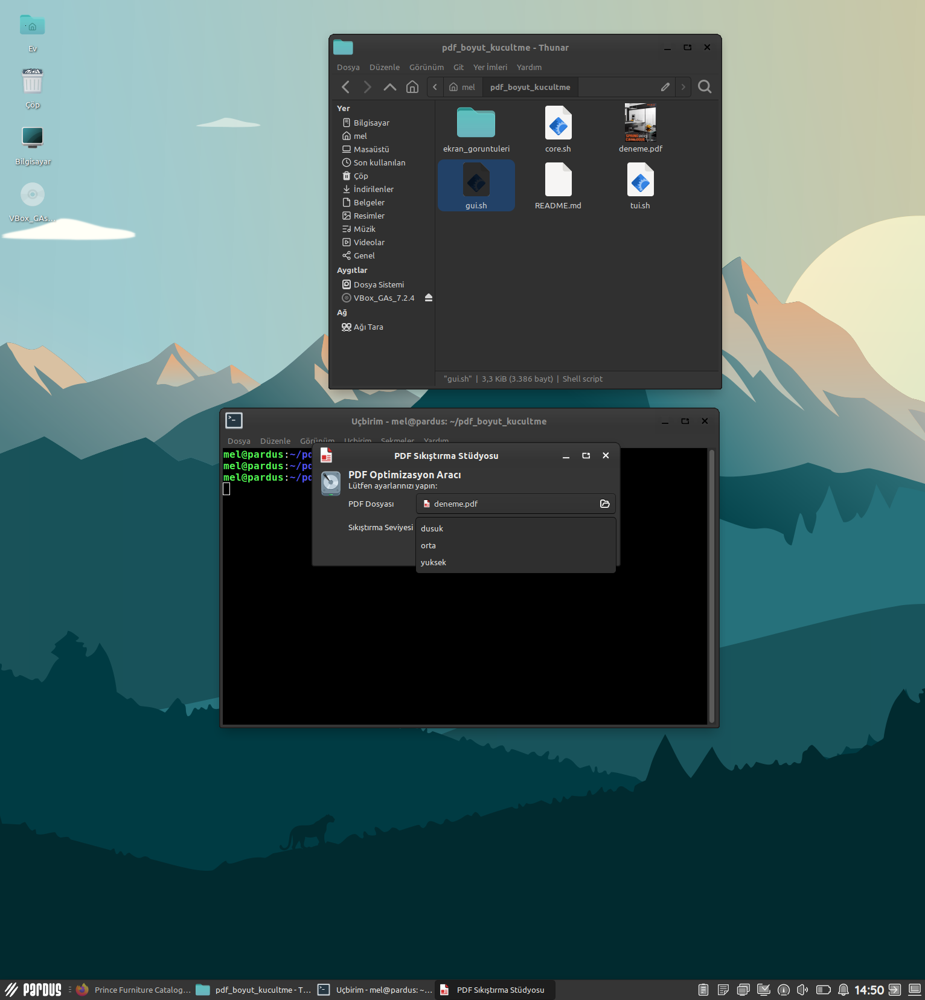
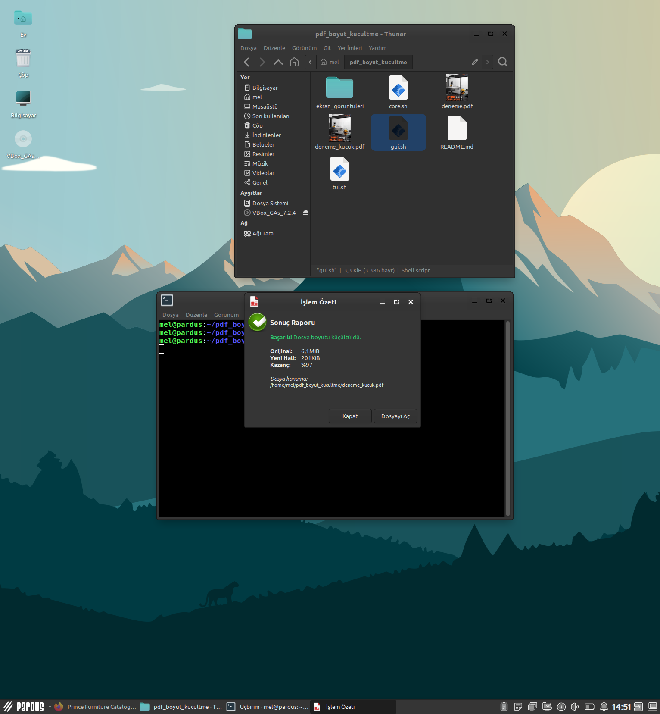
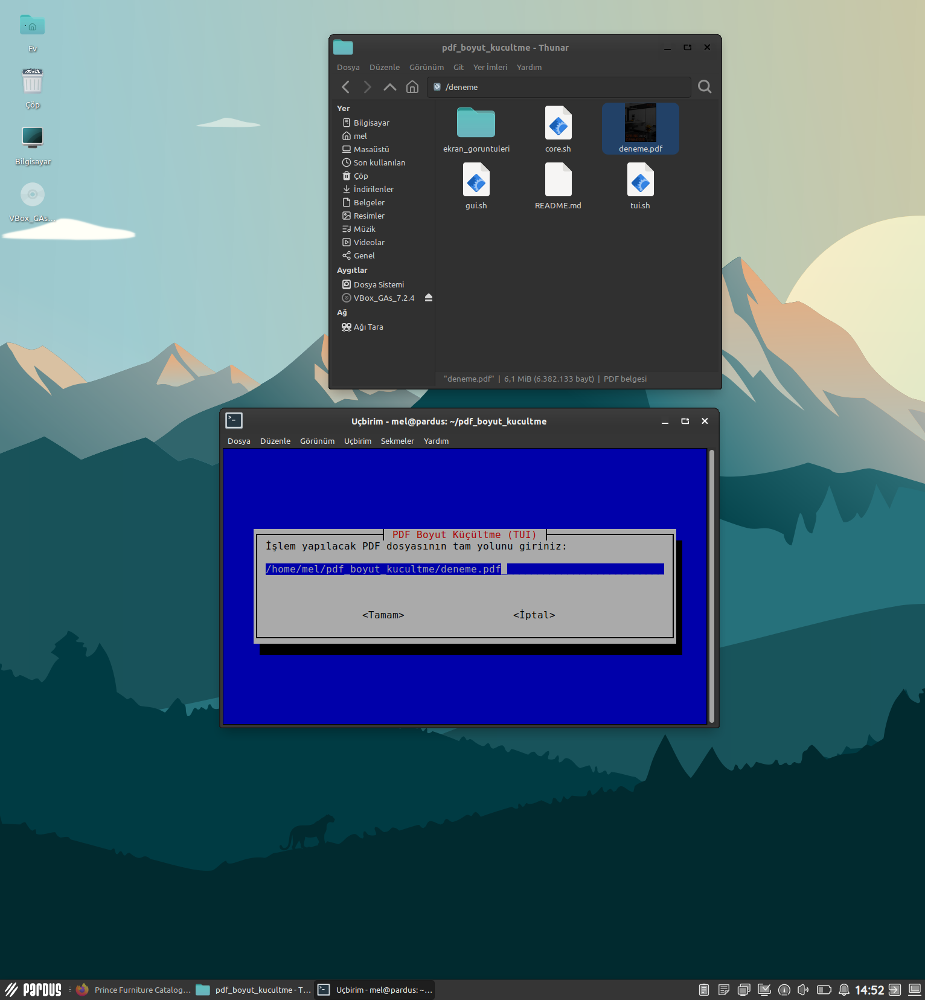
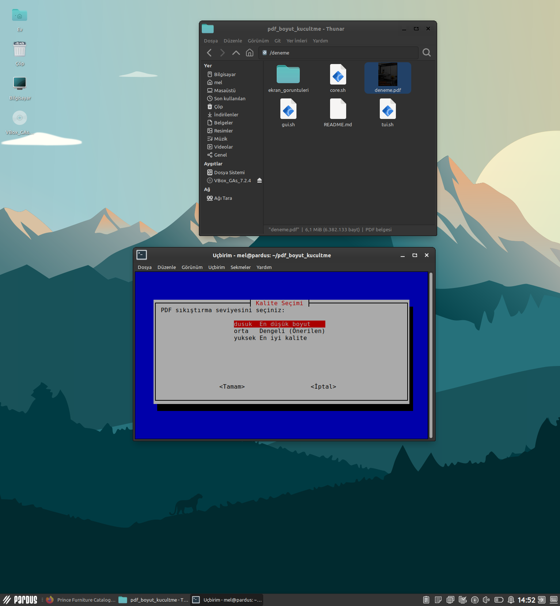
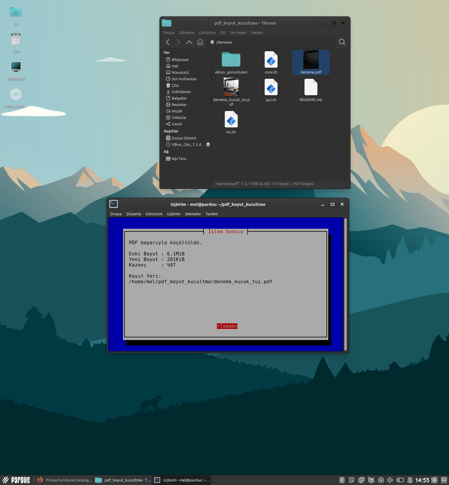

# PDF Size Reduction Tool (GUI + TUI)

This project is a Ghostscript-based PDF size reduction and optimization tool running on PARDUS Linux.
It is developed with Bash Script and provides both a graphical user interface (GUI) and a terminal user interface (TUI).

## Project Purpose

The purpose of this project is to develop a modular and PARDUS-compatible tool capable of reducing the size of PDF files in a user-friendly way within the Linux environment.

Within the scope of the project, two different usage scenarios are supported by utilizing both a graphical interface and a terminal-based interface.

## Features

- Reduce PDF file size
- Three different compression levels:
  - Low: Smallest file size
  - Medium: Balanced (recommended)
  - High: Best quality
- Graphical user interface (YAD)
- Terminal user interface (Whiptail)
- Detailed post-processing reporting
- Modular code structure

### Technical Equivalents of Compression Levels

Compression operations are performed using the following quality profiles of Ghostscript:

- **Low**: `/screen`  
  Highest compression ratio, smallest file size

- **Medium**: `/ebook`  
  Balanced structure between file size and quality

- **High**: `/prepress`  
  Highest quality, lowest compression

## Project Structure

```text
pdf_boyut_kucultme/
├── core.sh      # Common PDF compression functions
├── gui.sh       # Graphical user interface (YAD)
├── tui.sh       # Terminal user interface (Whiptail)
├── README.md    # Project documentation

## Technologies Used

- Bash Script
- Ghostscript
- YAD (Yet Another Dialog)
- Whiptail
- PARDUS Linux

## Requirements

For the project to run, the following packages must be installed on the system:

- ghostscript
- yad
- whiptail

### Package Installation

```bash
sudo apt update
sudo apt install ghostscript yad whiptail -y
```

## Installation Steps

1. Clone the repository:

```bash
git clone https://github.com/mlkyzgt/pdf_boyut_kucultme.git
```

2. Enter the project directory:

```bash
cd pdf_boyut_kucultme
```

3. Grant execution permissions to the script files:

```bash
chmod +x core.sh gui.sh tui.sh
```

## Usage

### Graphical User Interface (GUI)

```bash
./gui.sh
```

A PDF file is selected, and the compression level is determined via the graphical interface.





### Terminal User Interface (TUI)

```bash
./tui.sh
```

The PDF file path and compression level are entered using terminal-based menus.







## Working Logic

PDF compression operations are performed through common functions located in the core.sh file.
The GUI and TUI interfaces only gather the necessary information from the user and utilize the same core function.

Thanks to this structure, code repetition is avoided, and a modular architecture is achieved.


